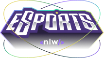
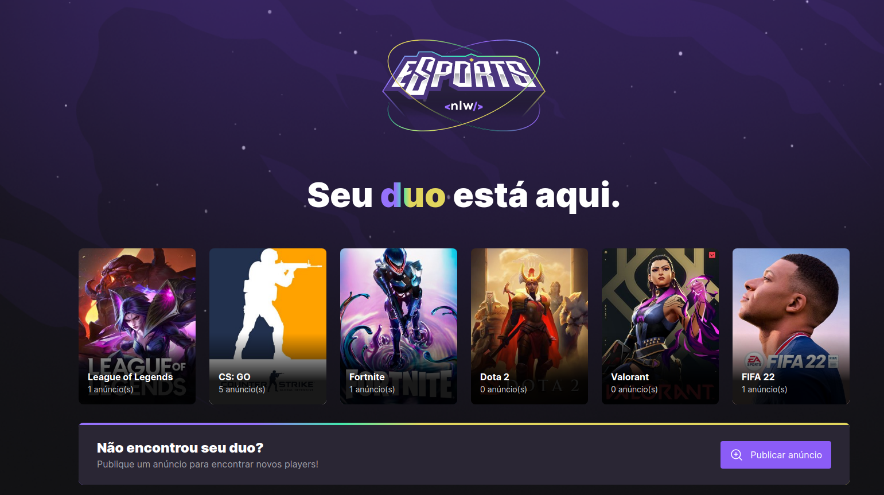
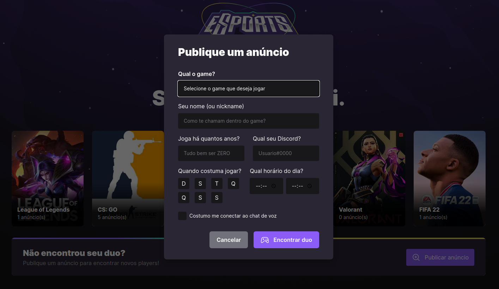
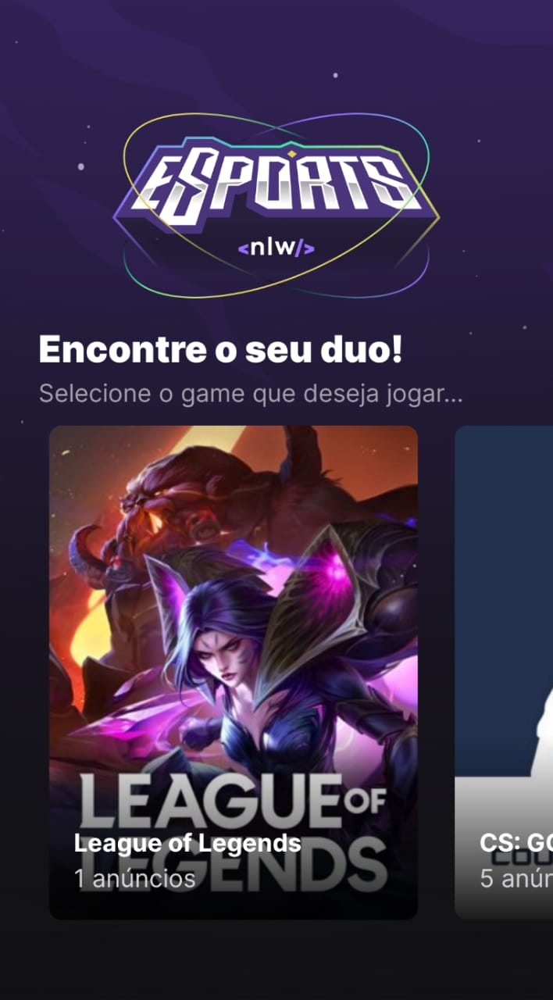
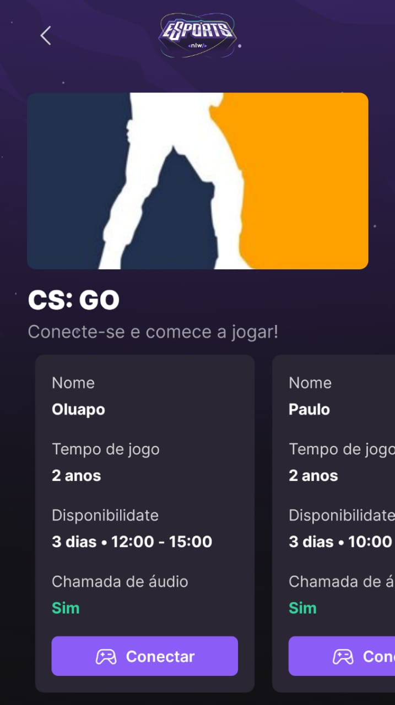
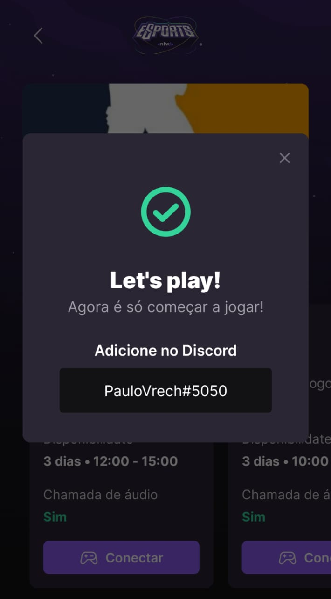

<h2 align="center">
    
</h2>
<p align="center">
  <h1 align="center">NLW eSports | Rocketseat 🚀</h1>
</p>

## 💻 Sobre o projeto

A aplicação tem como objetivo ajudar os jogadores a encontrarem novos parceiros para as suas jogatinas.
Através do ambiente WEB, é possível cadastrar novos anúncios e visualizar os anúncios de outros usuários nos jogos cadastrados.
Pelo aplicativo mobile, além das mesmas funções, é possível visualizar o Discord do jogador daquele anúncio específico, assim como outras informações!

---

## 👀 Demo

- Versão WEB
<div align="center">
    
</div>
<div align="center">
    
</div>

---

- Versão Mobile
<div align="center">
    
    
    
</div>

---

## 🚀 Técnologias utilizadas

Esse projeto foi desenvolvido utilizando as seguintes tecnologias:

- [ReactJs](https://reactjs.org)
- [ReactNative](https://reactnative.dev)
- [Node.js](https://nodejs.org/en/)
- [Tailwindcss](https://tailwindcss.com/)
- [Javascript](https://developer.mozilla.org/pt-BR/docs/Web/JavaScript)
- [Typescript](https://www.typescriptlang.org/)
- [Expo](https://expo.dev/)
- [Radix UI](https://www.radix-ui.com/)
- [Phosphoricons](https://phosphoricons.com/)
- [Prisma ORM](https://www.prisma.io//)
- [Vite](https://vitejs.dev/)

---

## 🛠 Como executar o projeto em sua máquina

Este projeto é composto pelo BACKEND(server), FRONTEND(web) e MOBILE(mobile).
<br><strong>Para execuar o FRONTEND e o MOBILE, o BACKEND precisa estar em execução!</strong>

### ⚙ Executando o Backend (server)

```bash

# Clone este repositório
$ git clone https://github.com/paulomvrech/NLW-eSports.git

# Acesse a pasta do projeto no seu terminal/cmd
$ cd NLW-eSports/server

# Instale as dependências necessárias
$ npm install

# Inicie o server
$ npm run dev

```

### 🖥 Executando o Frontend (web)

```bash

# Entre no diretório do Frontend
$ cd NLW-eSports/web

# Instale as dependências necessárias
$ npm install

# Inicie a aplicação
$ npm run dev

# Acesse o endereço mostrado em seu navegador:
http://localhost:5173

```

### 📱 Executando o Mobile (mobile)

```bash

# Entre no diretório do Mobile
$ cd NLW-eSports/mobile

# Instale as dependências necessárias
$ npm install

# Inicie a aplicação
$ expo start

# Utilize um emulador configurado em seu computator, ou baixe o aplicativo ExpoGO em seu celular para escanear o QRCode mostrado em tela e assim emular em seu próprio dispositivo.


```

---

<p align="center">Desenvolvido por 👏 Paulo Muller Vrech</p>
